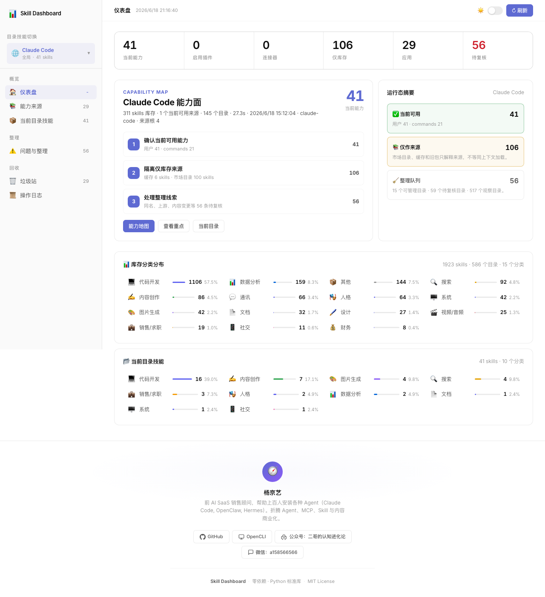
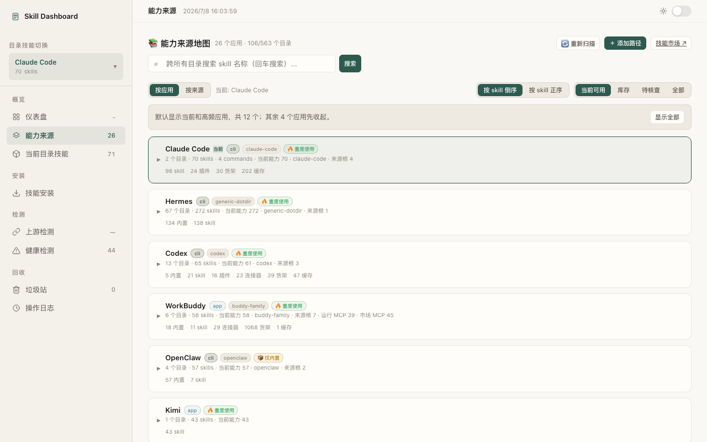
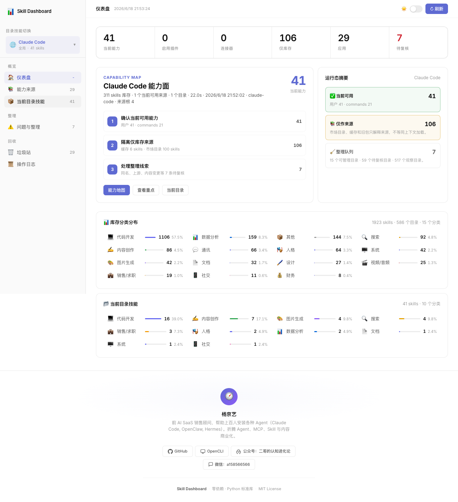

# 📊 Skill Dashboard

可视化管理本地技能库（Skills）的轻量 WebUI。**零前端依赖，纯 Python 标准库。**


---

## 截图

> 运行 `python3 serve.py` 后，浏览器自动打开 `http://localhost:3457`。

### 仪表盘



> 上图替换方式：运行项目后按 `Cmd+Shift+4` 截图保存到 `screenshots/dashboard.png`

### 技能库来源浏览



### 上游追踪



### 相似度检测


---

## 功能

**完全独立，零外部依赖。** 不装任何额外工具，一个 Python 文件跑起来。

| 功能 | 说明 |
|---|---|
| 📦 **列出 Skills** | 即时扫描任意技能库目录，毫秒级 |
| 🔄 **切换目标库** | 支持 Claude Code / Codex / Agents / Alice / CC-Switch / Hermes / WorkBuddy / CodeBuddy 等 10+ 个技能库 |
| 📚 **技能库来源浏览** | 扫描 150+ 个来源库，支持穿透查看、批量同步到目标库 |
| 🏷️ **自动分类** | JS 关键词引擎，14 个分类 + 支持 frontmatter `category` 覆盖 |
| 📖 **查看内容** | 点击 skill 名称查看 SKILL.md 全文 |
| 🏥 **健康评分** | Python 自主计算，不依赖 bash |
| ⚠️ **结构问题** | broken symlink、缺 frontmatter、oversized 检测 |
| 🔍 **轻量相似度** | 前端 Jaccard 算法，基于 name + description 关键词重叠分析 |
| 🔗 **上游追踪** | 自动检测 `.git` 来源 + `.skill-source.env` 安装记录 |
| 🔄 **上游更新检测** | urllib 调 GitHub API，对比 installed vs latest commit |
| ⬇️ **安装 Skill** | 粘贴 GitHub URL → Python 自动 git clone + 子目录选择 + 快照备份 |
| ⬆️ **更新 Skill** | 一键从上游重新安装，自动快照 |
| 💾 **清理候选** | 基于规则自动推荐无用/低质量 skill |
| 📤 **导入/导出** | 批量导入 GitHub URL，导出 Markdown 格式清单 |

---

## 安装

```bash
# 克隆仓库
git clone https://github.com/yang1996202-cpu/skill-dashboard.git
cd skill-dashboard

# 启动（零依赖，无需 npm/pip install）
python3 serve.py
```

浏览器自动打开 `http://localhost:3457`。

---

## 架构

```
用户操作 → fast-scan (5-10ms) → 页面立刻渲染
                ↓
          Python quick-check (~10ms) → 健康分 + 结构问题 + 上游追踪 + 清理候选
                ↓
    点「一键诊断」→ Python diagnosis (~5s) → 完整数据 + 上游版本状态
```

**设计原则**：
- Layer 0（自主）：列出、分类、切换、查看、结构检查、健康评分、上游追踪、相似度、清理候选、安装、更新
- 所有写操作（安装、删除、更新）都有自动快照备份

---

## 技术栈

- **后端**：Python 3 标准库（`http.server`），零依赖
- **前端**：单文件 HTML + CSS + JS，无框架
- **数据源**：直接读文件系统 + GitHub REST API

---

## 上游追踪说明

上游追踪通过两种方式检测：

1. **`.git` 目录**：读取 `git remote get-url origin`
2. **`.skill-source.env`**：读取来源记录文件（Dashboard 安装时自动写入）

更新检测使用 GitHub REST API（`repos/{owner}/{repo}/commits`），无需 `gh` CLI，无需 token。

如果某个 skill 既没有 `.git` 也没有 `.skill-source.env`，则检测不到上游。这不是 bug，是本地没有来源记录。

---

## License

MIT
