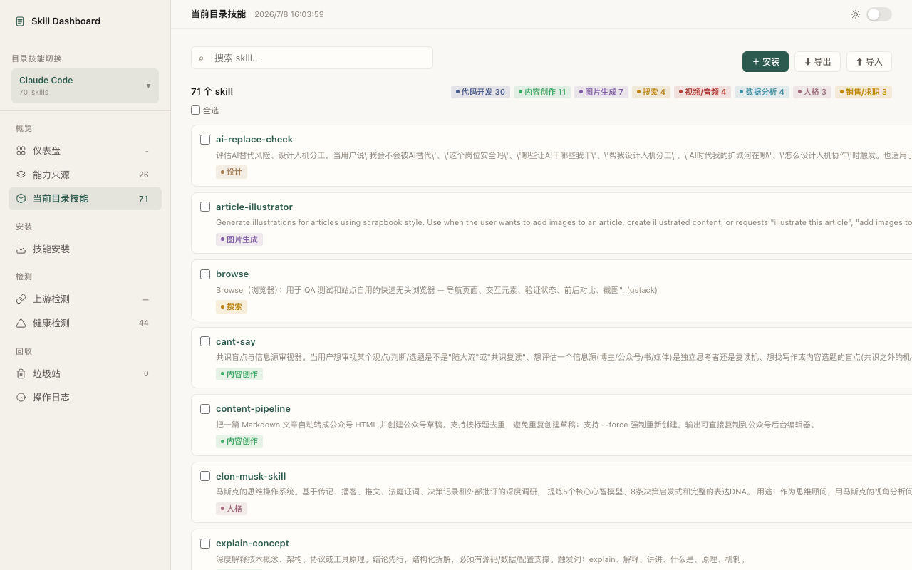
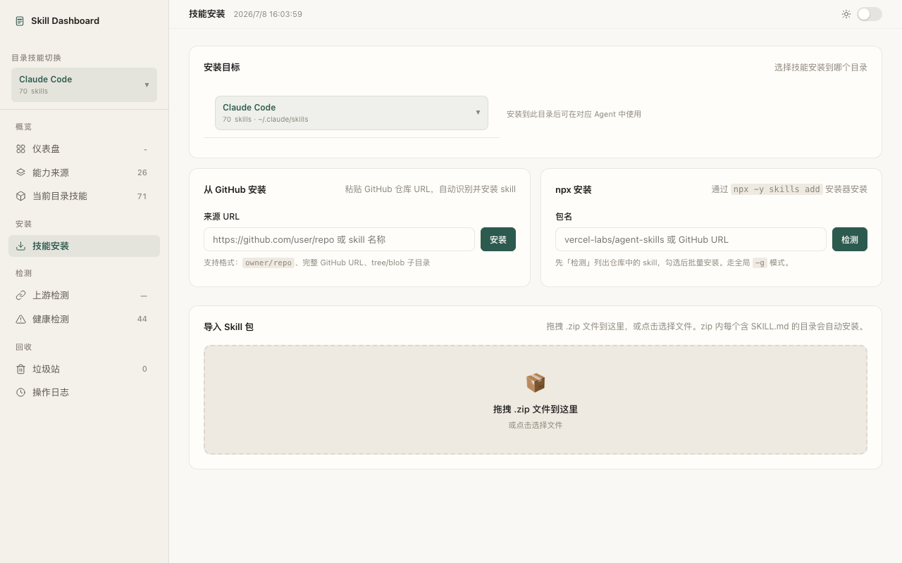

# 📊 Skill Dashboard

把散落在 10+ 个 Agent 目录里的 AI skill 扫进一张图，看清谁重复、谁过时、谁该删。**零依赖本地 WebUI，纯 Python 标准库，clone 即跑。**


---

## 和同类工具不同

| | Skill Dashboard | [Skills-Manager](https://github.com/jiweiyeah/Skills-Manager) | [cc-switch](https://github.com/farion1231/cc-switch) | [Skills CLI](https://medium.com/@anivlis/skills-cli-manage-your-ai-agent-capabilities-with-a-single-tool-51e12e6bc1d3) |
|---|---|---|---|---|
| 形态 | 零依赖本地 WebUI（浏览器打开） | 桌面应用（Tauri） | 桌面应用（Tauri） | 命令行 |
| 主定位 | 全宿主 skill 治理：重复 / 上游 / 清理 dry-run | skill 组织、同步、分享 | API 供应商 / MCP / 提示词切换 | skill 浏览、多仓库 |
| 依赖 | 无（Python 标准库） | 需装桌面应用 | 需装桌面应用 | 需运行时 |

一句话：不装桌面应用、不连云、不动你的文件。`python3 serve.py` 起一个本地 WebUI，扫描全宿主目录，dry-run 给清理建议（移垃圾站可恢复），追踪 GitHub 上游版本，数据全程留在本机。

---

## 截图

> 运行 `python3 serve.py` 后，浏览器自动打开 `http://localhost:3457`。

### 仪表盘


### 当前目录技能（卡片网格 + 分类筛选）


### 技能安装（GitHub / npx / zip 导入）


### 能力来源地图


### 上游检测


### 健康检测


---

## 功能

**完全独立，零外部依赖。** 不装任何额外工具，一个 Python 入口跑起来。

| 功能 | 说明 |
|---|---|
| 📊 **仪表盘** | 资产规模 + 治理成果总览，当前目录能力摘要 |
| 📦 **当前目录技能** | 卡片网格展示，分类标签可点击筛选，搜索即时过滤 |
| ⬇️ **技能安装** | GitHub URL / npx CLI / zip 拖拽导入，三种方式装 skill |
| ⬇️ **导出/导入** | 单 skill / 批量 / 全部导出为 zip；支持拖拽 zip 导入安装 |
| 📚 **能力来源地图** | 扫描多宿主来源库，按 Agent 或作者仓库分组，穿透浏览 |
| 🏷️ **自动分类** | JS 关键词引擎，14 个分类 + frontmatter `category` 覆盖 |
| 🔗 **上游检测** | GitHub API 对比 installed vs latest commit，24h 智能缓存 |
| 🧭 **健康检测** | 同名/同内容副本、断链扫描，按 Agent 折叠，可勾选移垃圾站 |
| 🧹 **清理计划** | dry-run 目录治理方案，推荐候选一键移入垃圾站（可恢复） |
| 🔄 **切换目标库** | 支持 20+ Agent（Claude Code / Codex / Cursor / Hermes / WorkBuddy / CodeBuddy …） |
| 🧩 **插件状态** | Claude/Codex/Buddy family inspector 解释已启用、市场货架、缓存差异 |
| ⌨️ **Commands 浏览** | 识别 commands 目录，和 skills 分层展示 |
| 🧠 **理解层** | 离线规则解析 SKILL.md，生成中文用途、场景、能力标签 |
| 📜 **操作日志** | 记录删除、安装、更新、切换等本地操作 |

---

## 安装

```bash
# 克隆仓库
git clone https://github.com/yang1996202-cpu/skill-dashboard.git
cd skill-dashboard

# 启动（零依赖，无需 npm/pip install）
python3 serve.py
```

浏览器自动打开 `http://localhost:3457`。

---

## 架构

```
页面加载 → fast-scan + targets + global-stats → 先看到当前技能库和目录地图
                ↓
          understanding cache → 中文用途 + 场景/能力/风险标签（详情页按需加载）
                ↓
          点「开始整理」→ cleanup-execution-plan → 推荐移入垃圾站 / 保护 / 候选
                ↓
          展开高级线索 → scan-run（勾选同名/损坏链接） → 证据展示
```

**视图分层**：
- **当前可用**：用户根目录、宿主内置、已启用插件、连接器和 commands，解释“当前能力面”
- **来源库存**：marketplace/catalog、插件缓存、旧包和未启用安装包，只解释来源，不等同上下文加载
- **待复核**：项目级、导入副本、未知运行态目录，进入人工整理队列
- **全部**：保留完整扫描面，方便审计各 Agent 的专属目录形态

**并发**：后端使用 `ThreadingHTTPServer`，浏览器多个初始化请求并行处理，避免单线程队头阻塞导致穿透浏览超时。

**设计原则**：
- Layer 0（自主）：列出、分类筛选、卡片浏览、安装、导出/导入、上游追踪、健康检测、清理
- 理解层默认离线可用，不要求 API key；未来可接可选 AI 增强，但 UI 只依赖统一理解 schema
- 清理 dry-run 先行，候选移入垃圾站（可恢复），不直接永久删除
- 完全重复 skill 由「健康检测」→「同内容副本」tab 手动勾选删，不进自动化 trash 候选
- 所有写操作（安装、删除、更新）都有自动快照备份

---

## 技术栈

- **后端**：Python 3 标准库（`serve.py` + `skilldash/` 轻量模块），零依赖
- **前端**：HTML + CSS + 多个 classic JS 静态文件，无框架、无构建步骤
- **数据源**：直接读文件系统 + GitHub REST API

后端模块边界：

- `serve.py`：路由表分发 + 基础设施（CSRF / 静态 / JSON / 运行态缓存）；各 domain 的 handler 已拆成 mixin
- `skilldash/routes/`：按 domain 拆分的 HTTP handler mixin（system / source / skill / cleanup / scan）
- `skilldash/source_ops.py`：GitHub 业务（来源解析、安装、更新、上游检查），纯库，不依赖 serve
- `skilldash/discovery.py`：目录发现、Agent 推断、目录治理分层
- `skilldash/host_inspectors.py`：宿主专属解释器，将 Codex/Claude/WorkBuddy/CodeBuddy 的私有目录和非敏感 MCP 摘要转成统一 runtime metadata
- `skilldash/cleanup.py`：清理计划和可执行 dry-run 预案
- `skilldash/overlap.py`：跨目录同名和完全重复扫描
- `skilldash/content_hash.py`：内容 hash 追踪

前端模块边界：

- `index.html`：页面骨架和静态挂载点
- `static/skill-dashboard.css`：样式
- `static/app-core.js`：状态、数据加载、仪表盘、当前目录技能
- `static/issues-cleanup.js`：问题与整理、清理计划、垃圾站
- `static/sources.js`：能力来源、来源浏览、批量同步/删除
- `static/skill-detail.js`：详情、对比、分类编辑
- `static/app-bootstrap.js`：刷新、目标切换、启动加载
- `static/install.js`：技能安装页（steal / npx / zip 导入）

---

## 上游追踪说明

上游追踪通过三种方式检测来源：

1. **`.git` 目录**：读取 `git remote get-url origin`
2. **`.skill-source.env`**：读取来源记录文件（Dashboard 安装时自动写入）
3. **Vercel skills lock**：读取 `~/.agents/.skill-lock.json`（`npx skills add` 安装时写入）

更新检测使用 GitHub REST API（`repos/{owner}/{repo}/commits`），无需 `gh` CLI。

### GitHub Token（可选但强烈建议）

未配置 token 时，GitHub 对同一 IP 限制 **60 次/小时**。全量扫描一次可能就用完额度，导致上游检测失败。

配置 token 后额度提升到 **5000 次/小时**，全量扫描稳定可用。

配置方式二选一：

```bash
# 方式 1：环境变量
export GITHUB_TOKEN=ghp_xxx
python3 serve.py

# 方式 2：项目根目录 .env 文件（推荐，已加入 .gitignore 不会提交）
echo 'GITHUB_TOKEN=ghp_xxx' > .env
python3 serve.py
```

Token 生成路径：GitHub → Settings → Developer settings → Personal access tokens → Tokens (classic)。读取公开仓库不需要勾选任何 scope。

如果某个 skill 既没有 `.git`、也没有 `.skill-source.env`、也没有 Vercel lock，则检测不到上游。这不是 bug，是本地没有来源记录。

---

## License

MIT
